# Lockler User Action Sequence Diagrams

This document provides detailed sequence diagrams for all user actions in the Lockler system, showing both high-level user flows and detailed contract-to-contract interactions.

## Table of Contents

1. [Create Lockler](#1-create-lockler)
2. [Propose Transaction](#2-propose-transaction)
3. [Vouch For Proposal](#3-vouch-for-proposal)
4. [Challenge Proposal](#4-challenge-proposal)
5. [Request Arbitration](#5-request-arbitration)
6. [Execute Transaction](#6-execute-transaction)
7. [Withdraw Unchallenged Answer](#7-withdraw-unchallenged-answer)
8. [Claim Bond Rewards](#8-claim-bond-rewards)

---

## 1. Create Lockler

### 1.1 High-Level User Flow

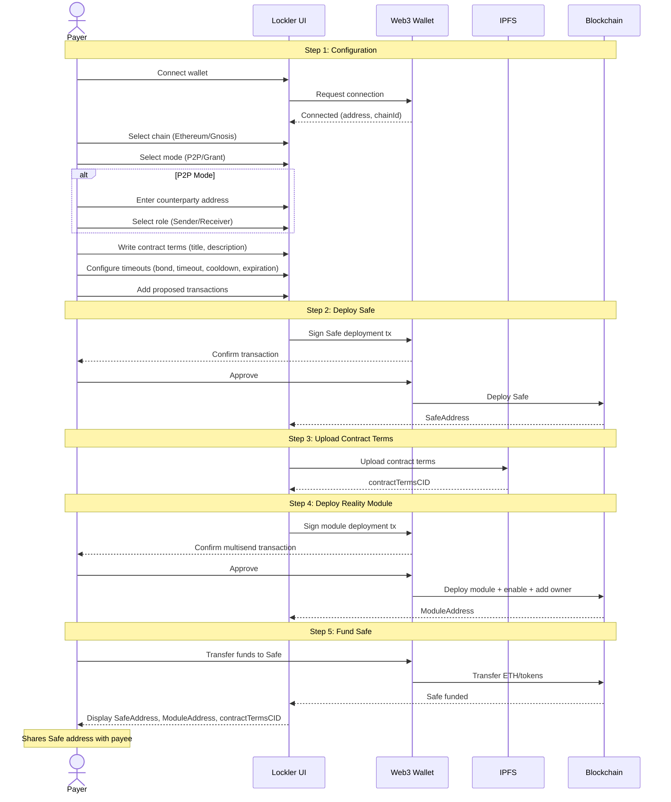
```mermaid
sequenceDiagram
    actor Payer
    participant UI as Lockler UI
    participant Wallet as Web3 Wallet
    participant IPFS
    participant Blockchain

    Note over Payer,Blockchain: Step 1: Configuration
    Payer->>UI: Connect wallet
    UI->>Wallet: Request connection
    Wallet-->>UI: Connected (address, chainId)

    Payer->>UI: Select chain (Ethereum/Gnosis)
    Payer->>UI: Select mode (P2P/Grant)

    alt P2P Mode
        Payer->>UI: Enter counterparty address
        Payer->>UI: Select role (Sender/Receiver)
    end

    Payer->>UI: Write contract terms (title, description)
    Payer->>UI: Configure timeouts (bond, timeout, cooldown, expiration)
    Payer->>UI: Add proposed transactions

    Note over Payer,Blockchain: Step 2: Deploy Safe
    UI->>Wallet: Sign Safe deployment tx
    Wallet-->>Payer: Confirm transaction
    Payer->>Wallet: Approve
    Wallet->>Blockchain: Deploy Safe
    Blockchain-->>UI: SafeAddress

    Note over Payer,Blockchain: Step 3: Upload Contract Terms
    UI->>IPFS: Upload contract terms
    IPFS-->>UI: contractTermsCID

    Note over Payer,Blockchain: Step 4: Deploy Reality Module
    UI->>Wallet: Sign module deployment tx
    Wallet-->>Payer: Confirm multisend transaction
    Payer->>Wallet: Approve
    Wallet->>Blockchain: Deploy module + enable + add owner
    Blockchain-->>UI: ModuleAddress

    Note over Payer,Blockchain: Step 5: Fund Safe
    Payer->>Wallet: Transfer funds to Safe
    Wallet->>Blockchain: Transfer ETH/tokens
    Blockchain-->>UI: Safe funded

    UI-->>Payer: Display SafeAddress, ModuleAddress, contractTermsCID
    Note over Payer: Shares Safe address with payee
```

### 1.2 Detailed Contract Interactions - Safe Deployment

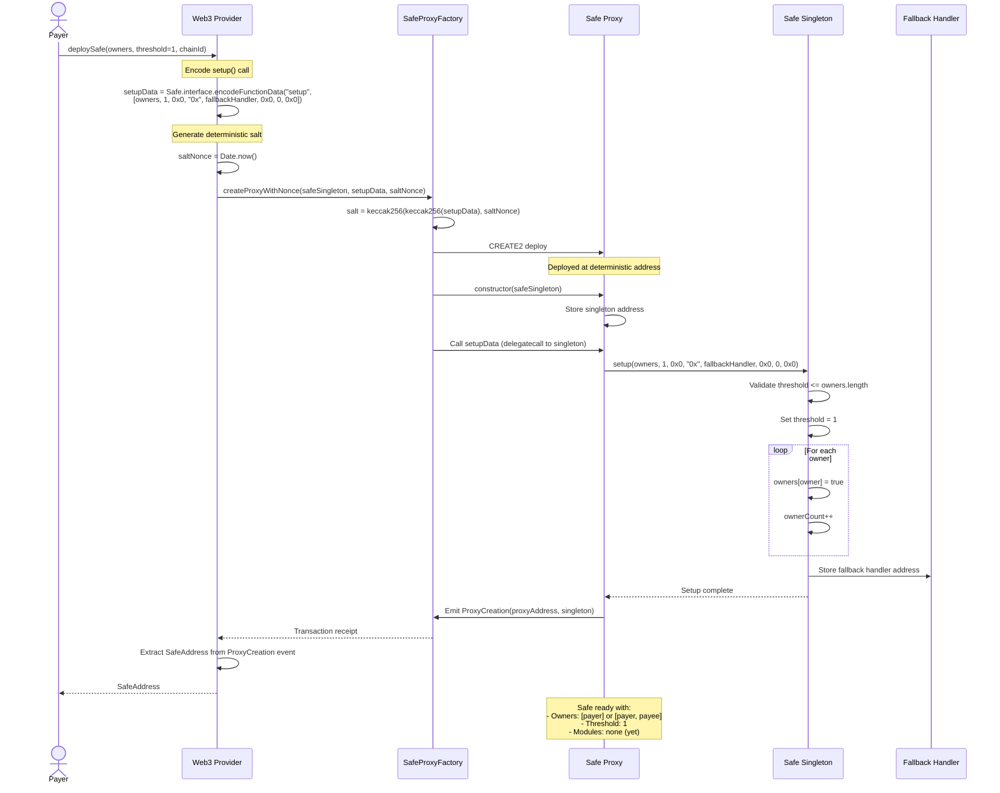
```mermaid
sequenceDiagram
    actor Payer
    participant Provider as Web3 Provider
    participant Factory as SafeProxyFactory
    participant Proxy as Safe Proxy
    participant Singleton as Safe Singleton
    participant Fallback as Fallback Handler

    Payer->>Provider: deploySafe(owners, threshold=1, chainId)

    Note over Provider: Encode setup() call
    Provider->>Provider: setupData = Safe.interface.encodeFunctionData("setup",<br/>[owners, 1, 0x0, "0x", fallbackHandler, 0x0, 0, 0x0])

    Note over Provider: Generate deterministic salt
    Provider->>Provider: saltNonce = Date.now()

    Provider->>Factory: createProxyWithNonce(safeSingleton, setupData, saltNonce)

    Factory->>Factory: salt = keccak256(keccak256(setupData), saltNonce)
    Factory->>Proxy: CREATE2 deploy
    Note over Proxy: Deployed at deterministic address

    Factory->>Proxy: constructor(safeSingleton)
    Proxy->>Proxy: Store singleton address

    Factory->>Proxy: Call setupData (delegatecall to singleton)
    Proxy->>Singleton: setup(owners, 1, 0x0, "0x", fallbackHandler, 0x0, 0, 0x0)

    Singleton->>Singleton: Validate threshold <= owners.length
    Singleton->>Singleton: Set threshold = 1

    loop For each owner
        Singleton->>Singleton: owners[owner] = true
        Singleton->>Singleton: ownerCount++
    end

    Singleton->>Fallback: Store fallback handler address
    Singleton-->>Proxy: Setup complete

    Proxy->>Factory: Emit ProxyCreation(proxyAddress, singleton)
    Factory-->>Provider: Transaction receipt

    Provider->>Provider: Extract SafeAddress from ProxyCreation event
    Provider-->>Payer: SafeAddress

    Note over Proxy: Safe ready with:<br/>- Owners: [payer] or [payer, payee]<br/>- Threshold: 1<br/>- Modules: none (yet)
```

### 1.3 Detailed Contract Interactions - Module Deployment

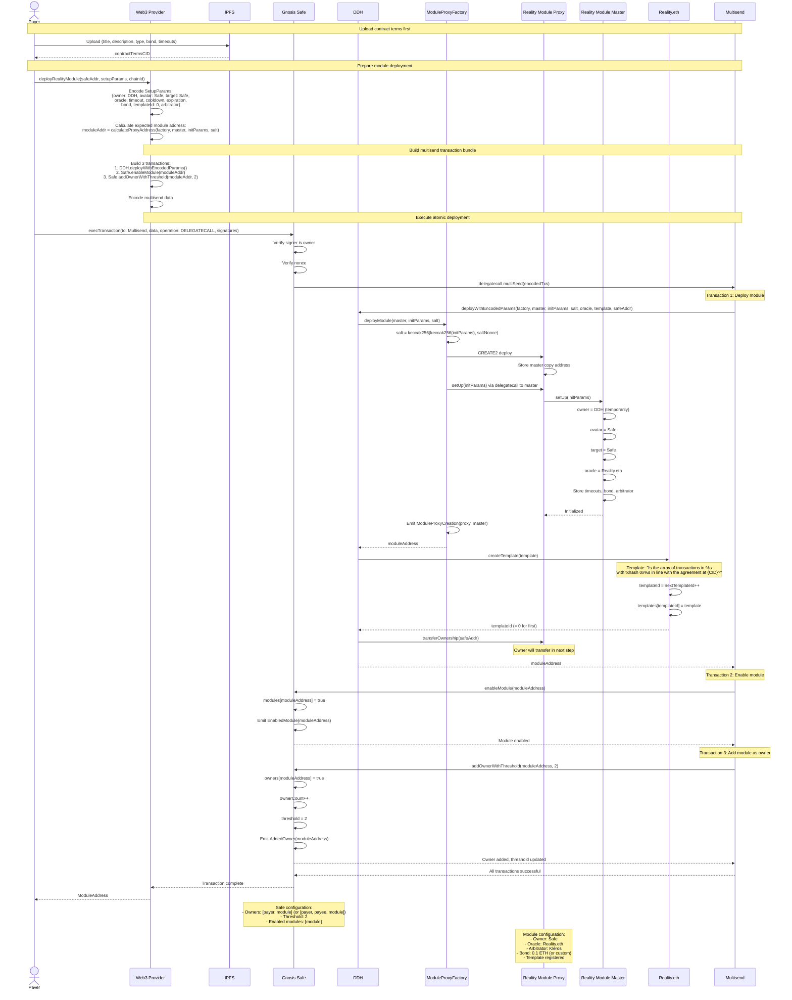
```mermaid
sequenceDiagram
    actor Payer
    participant Provider as Web3 Provider
    participant IPFS
    participant Safe as Gnosis Safe
    participant DDH
    participant ModFactory as ModuleProxyFactory
    participant ModProxy as Reality Module Proxy
    participant ModMaster as Reality Module Master
    participant Oracle as Reality.eth
    participant Multisend

    Note over Payer,Multisend: Upload contract terms first
    Payer->>IPFS: Upload {title, description, type, bond, timeouts}
    IPFS-->>Payer: contractTermsCID

    Note over Payer,Multisend: Prepare module deployment
    Payer->>Provider: deployRealityModule(safeAddr, setupParams, chainId)

    Provider->>Provider: Encode SetupParams:<br/>{owner: DDH, avatar: Safe, target: Safe,<br/>oracle, timeout, cooldown, expiration,<br/>bond, templateId: 0, arbitrator}

    Provider->>Provider: Calculate expected module address:<br/>moduleAddr = calculateProxyAddress(factory, master, initParams, salt)

    Note over Provider,Multisend: Build multisend transaction bundle
    Provider->>Provider: Build 3 transactions:<br/>1. DDH.deployWithEncodedParams()<br/>2. Safe.enableModule(moduleAddr)<br/>3. Safe.addOwnerWithThreshold(moduleAddr, 2)

    Provider->>Provider: Encode multisend data

    Note over Provider,Multisend: Execute atomic deployment
    Payer->>Safe: execTransaction(to: Multisend, data, operation: DELEGATECALL, signatures)

    Safe->>Safe: Verify signer is owner
    Safe->>Safe: Verify nonce
    Safe->>Multisend: delegatecall multiSend(encodedTxs)

    Note over Multisend: Transaction 1: Deploy module
    Multisend->>DDH: deployWithEncodedParams(factory, master, initParams, salt, oracle, template, safeAddr)

    DDH->>ModFactory: deployModule(master, initParams, salt)
    ModFactory->>ModFactory: salt = keccak256(keccak256(initParams), saltNonce)
    ModFactory->>ModProxy: CREATE2 deploy
    ModProxy->>ModProxy: Store master copy address
    ModFactory->>ModProxy: setUp(initParams) via delegatecall to master

    ModProxy->>ModMaster: setUp(initParams)
    ModMaster->>ModMaster: owner = DDH (temporarily)
    ModMaster->>ModMaster: avatar = Safe
    ModMaster->>ModMaster: target = Safe
    ModMaster->>ModMaster: oracle = Reality.eth
    ModMaster->>ModMaster: Store timeouts, bond, arbitrator
    ModMaster-->>ModProxy: Initialized

    ModFactory->>ModFactory: Emit ModuleProxyCreation(proxy, master)
    ModFactory-->>DDH: moduleAddress

    DDH->>Oracle: createTemplate(template)
    Note over Oracle: Template: "Is the array of transactions in %s<br/>with txhash 0x%s in line with the agreement at {CID}?"
    Oracle->>Oracle: templateId = nextTemplateId++
    Oracle->>Oracle: templates[templateId] = template
    Oracle-->>DDH: templateId (= 0 for first)

    DDH->>ModProxy: transferOwnership(safeAddr)
    Note over ModProxy: Owner will transfer in next step

    DDH-->>Multisend: moduleAddress

    Note over Multisend: Transaction 2: Enable module
    Multisend->>Safe: enableModule(moduleAddress)
    Safe->>Safe: modules[moduleAddress] = true
    Safe->>Safe: Emit EnabledModule(moduleAddress)
    Safe-->>Multisend: Module enabled

    Note over Multisend: Transaction 3: Add module as owner
    Multisend->>Safe: addOwnerWithThreshold(moduleAddress, 2)
    Safe->>Safe: owners[moduleAddress] = true
    Safe->>Safe: ownerCount++
    Safe->>Safe: threshold = 2
    Safe->>Safe: Emit AddedOwner(moduleAddress)
    Safe-->>Multisend: Owner added, threshold updated

    Multisend-->>Safe: All transactions successful
    Safe-->>Provider: Transaction complete

    Provider-->>Payer: ModuleAddress

    Note over Safe: Safe configuration:<br/>- Owners: [payer, module] (or [payer, payee, module])<br/>- Threshold: 2<br/>- Enabled modules: [module]

    Note over ModProxy: Module configuration:<br/>- Owner: Safe<br/>- Oracle: Reality.eth<br/>- Arbitrator: Kleros<br/>- Bond: 0.1 ETH (or custom)<br/>- Template registered
```

---

## 2. Propose Transaction

### 2.1 High-Level User Flow

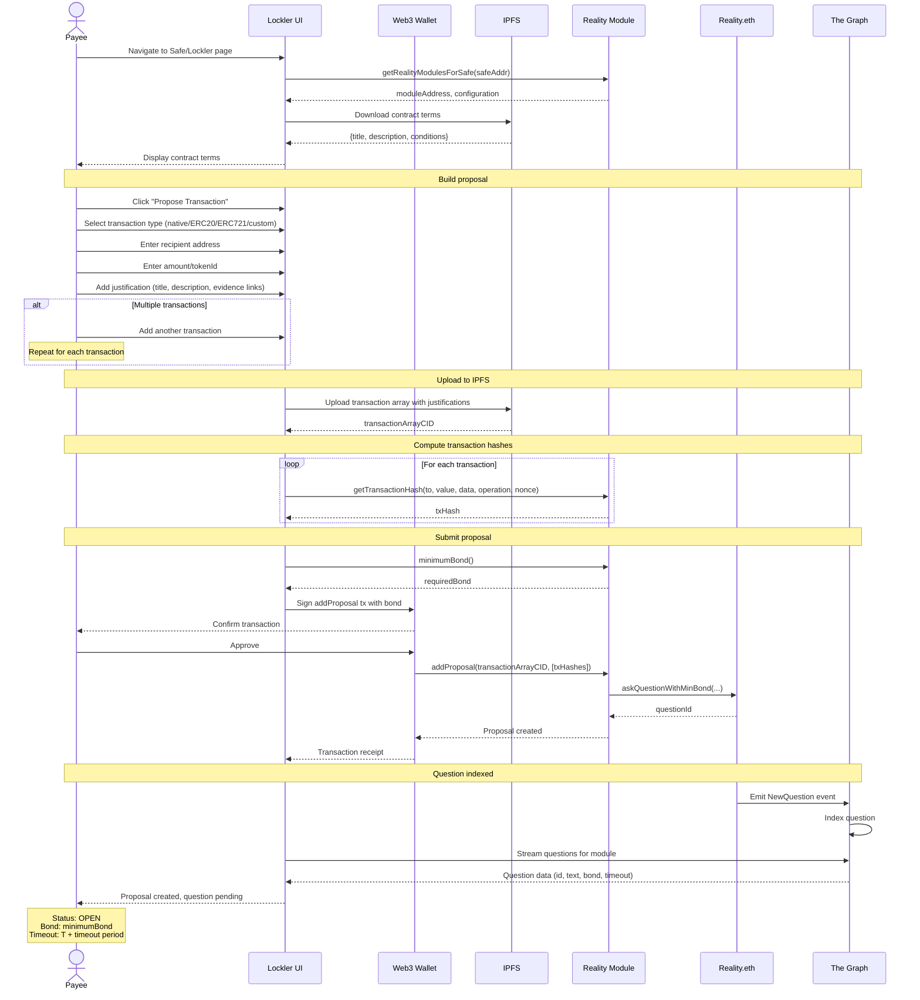
```mermaid
sequenceDiagram
    actor Payee
    participant UI as Lockler UI
    participant Wallet as Web3 Wallet
    participant IPFS
    participant Module as Reality Module
    participant Oracle as Reality.eth
    participant Subgraph as The Graph

    Payee->>UI: Navigate to Safe/Lockler page
    UI->>Module: getRealityModulesForSafe(safeAddr)
    Module-->>UI: moduleAddress, configuration

    UI->>IPFS: Download contract terms
    IPFS-->>UI: {title, description, conditions}
    UI-->>Payee: Display contract terms

    Note over Payee,Subgraph: Build proposal
    Payee->>UI: Click "Propose Transaction"
    Payee->>UI: Select transaction type (native/ERC20/ERC721/custom)
    Payee->>UI: Enter recipient address
    Payee->>UI: Enter amount/tokenId
    Payee->>UI: Add justification (title, description, evidence links)

    alt Multiple transactions
        Payee->>UI: Add another transaction
        Note over Payee: Repeat for each transaction
    end

    Note over Payee,Subgraph: Upload to IPFS
    UI->>IPFS: Upload transaction array with justifications
    IPFS-->>UI: transactionArrayCID

    Note over Payee,Subgraph: Compute transaction hashes
    loop For each transaction
        UI->>Module: getTransactionHash(to, value, data, operation, nonce)
        Module-->>UI: txHash
    end

    Note over Payee,Subgraph: Submit proposal
    UI->>Module: minimumBond()
    Module-->>UI: requiredBond

    UI->>Wallet: Sign addProposal tx with bond
    Wallet-->>Payee: Confirm transaction
    Payee->>Wallet: Approve

    Wallet->>Module: addProposal(transactionArrayCID, [txHashes])
    Module->>Oracle: askQuestionWithMinBond(...)
    Oracle-->>Module: questionId
    Module-->>Wallet: Proposal created
    Wallet-->>UI: Transaction receipt

    Note over Payee,Subgraph: Question indexed
    Oracle->>Subgraph: Emit NewQuestion event
    Subgraph->>Subgraph: Index question

    UI->>Subgraph: Stream questions for module
    Subgraph-->>UI: Question data (id, text, bond, timeout)

    UI-->>Payee: Proposal created, question pending
    Note over Payee: Status: OPEN<br/>Bond: minimumBond<br/>Timeout: T + timeout period
```

### 2.2 Detailed Contract Interactions

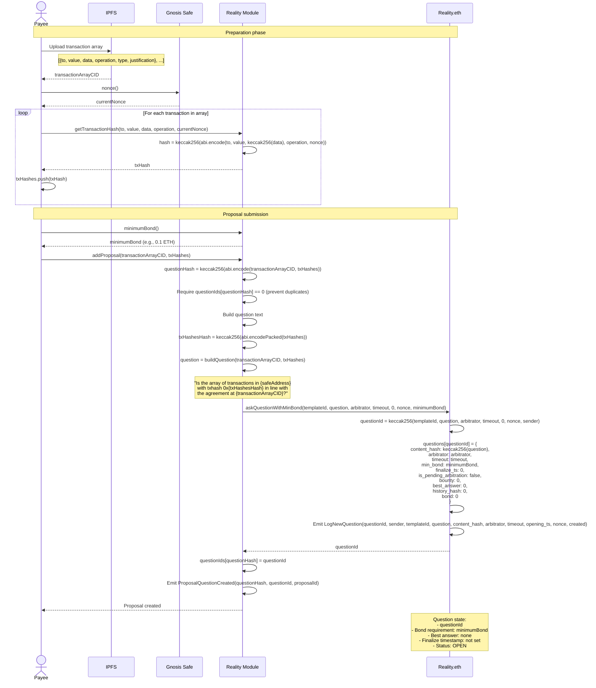
```mermaid
sequenceDiagram
    actor Payee
    participant IPFS
    participant Safe as Gnosis Safe
    participant Module as Reality Module
    participant Oracle as Reality.eth

    Note over Payee,Oracle: Preparation phase
    Payee->>IPFS: Upload transaction array
    Note over IPFS: [{to, value, data, operation, type, justification}, ...]
    IPFS-->>Payee: transactionArrayCID

    Payee->>Safe: nonce()
    Safe-->>Payee: currentNonce

    loop For each transaction in array
        Payee->>Module: getTransactionHash(to, value, data, operation, currentNonce)
        Module->>Module: hash = keccak256(abi.encode(to, value, keccak256(data), operation, nonce))
        Module-->>Payee: txHash
        Payee->>Payee: txHashes.push(txHash)
    end

    Note over Payee,Oracle: Proposal submission
    Payee->>Module: minimumBond()
    Module-->>Payee: minimumBond (e.g., 0.1 ETH)

    Payee->>Module: addProposal(transactionArrayCID, txHashes)

    Module->>Module: questionHash = keccak256(abi.encode(transactionArrayCID, txHashes))
    Module->>Module: Require questionIds[questionHash] == 0 (prevent duplicates)

    Module->>Module: Build question text
    Module->>Module: txHashesHash = keccak256(abi.encodePacked(txHashes))
    Module->>Module: question = buildQuestion(transactionArrayCID, txHashes)
    Note over Module: "Is the array of transactions in {safeAddress}<br/>with txhash 0x{txHashesHash} in line with<br/>the agreement at {transactionArrayCID}?"

    Module->>Oracle: askQuestionWithMinBond(templateId, question, arbitrator, timeout, 0, nonce, minimumBond)

    Oracle->>Oracle: questionId = keccak256(templateId, question, arbitrator, timeout, 0, nonce, sender)
    Oracle->>Oracle: questions[questionId] = {<br/>  content_hash: keccak256(question),<br/>  arbitrator: arbitrator,<br/>  timeout: timeout,<br/>  min_bond: minimumBond,<br/>  finalize_ts: 0,<br/>  is_pending_arbitration: false,<br/>  bounty: 0,<br/>  best_answer: 0,<br/>  history_hash: 0,<br/>  bond: 0<br/>}
    Oracle->>Oracle: Emit LogNewQuestion(questionId, sender, templateId, question, content_hash, arbitrator, timeout, opening_ts, nonce, created)
    Oracle-->>Module: questionId

    Module->>Module: questionIds[questionHash] = questionId
    Module->>Module: Emit ProposalQuestionCreated(questionHash, questionId, proposalId)
    Module-->>Payee: Proposal created

    Note over Oracle: Question state:<br/>- questionId<br/>- Bond requirement: minimumBond<br/>- Best answer: none<br/>- Finalize timestamp: not set<br/>- Status: OPEN
```

---

## 3. Vouch For Proposal

### 3.1 High-Level User Flow

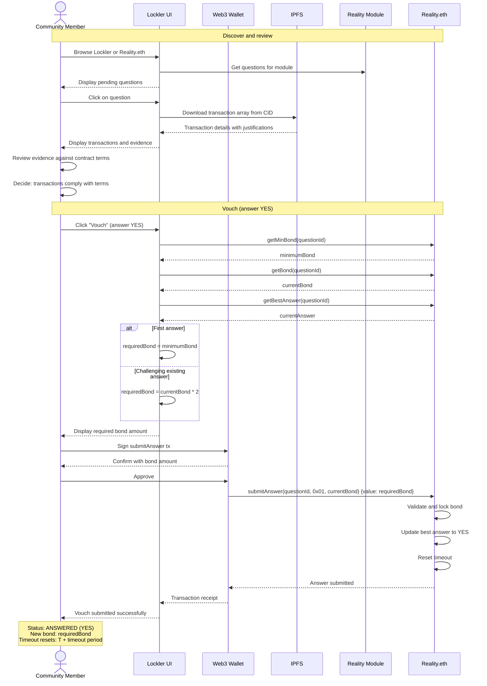
```mermaid
sequenceDiagram
    actor Voucher as Community Member
    participant UI as Lockler UI
    participant Wallet as Web3 Wallet
    participant IPFS
    participant Module as Reality Module
    participant Oracle as Reality.eth

    Note over Voucher,Oracle: Discover and review
    Voucher->>UI: Browse Lockler or Reality.eth
    UI->>Module: Get questions for module
    UI-->>Voucher: Display pending questions

    Voucher->>UI: Click on question
    UI->>IPFS: Download transaction array from CID
    IPFS-->>UI: Transaction details with justifications
    UI-->>Voucher: Display transactions and evidence

    Voucher->>Voucher: Review evidence against contract terms
    Voucher->>Voucher: Decide: transactions comply with terms

    Note over Voucher,Oracle: Vouch (answer YES)
    Voucher->>UI: Click "Vouch" (answer YES)

    UI->>Oracle: getMinBond(questionId)
    Oracle-->>UI: minimumBond
    UI->>Oracle: getBond(questionId)
    Oracle-->>UI: currentBond
    UI->>Oracle: getBestAnswer(questionId)
    Oracle-->>UI: currentAnswer

    alt First answer
        UI->>UI: requiredBond = minimumBond
    else Challenging existing answer
        UI->>UI: requiredBond = currentBond * 2
    end

    UI-->>Voucher: Display required bond amount

    Voucher->>Wallet: Sign submitAnswer tx
    Wallet-->>Voucher: Confirm with bond amount
    Voucher->>Wallet: Approve

    Wallet->>Oracle: submitAnswer(questionId, 0x01, currentBond) {value: requiredBond}
    Oracle->>Oracle: Validate and lock bond
    Oracle->>Oracle: Update best answer to YES
    Oracle->>Oracle: Reset timeout
    Oracle-->>Wallet: Answer submitted
    Wallet-->>UI: Transaction receipt

    UI-->>Voucher: Vouch submitted successfully
    Note over Voucher: Status: ANSWERED (YES)<br/>New bond: requiredBond<br/>Timeout resets: T + timeout period
```

### 3.2 Detailed Contract Interactions

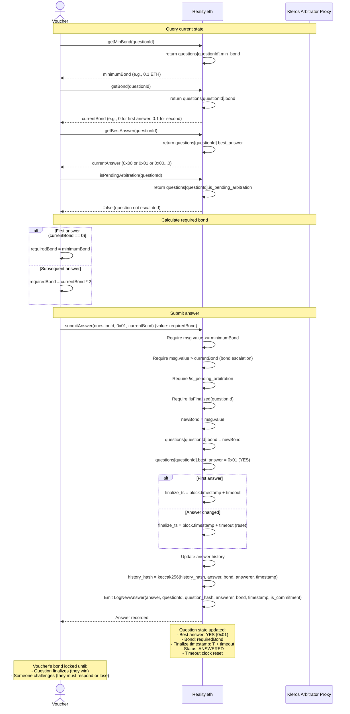
```mermaid
sequenceDiagram
    actor Voucher
    participant Oracle as Reality.eth
    participant Arbitrator as Kleros Arbitrator Proxy

    Note over Voucher,Arbitrator: Query current state
    Voucher->>Oracle: getMinBond(questionId)
    Oracle->>Oracle: return questions[questionId].min_bond
    Oracle-->>Voucher: minimumBond (e.g., 0.1 ETH)

    Voucher->>Oracle: getBond(questionId)
    Oracle->>Oracle: return questions[questionId].bond
    Oracle-->>Voucher: currentBond (e.g., 0 for first answer, 0.1 for second)

    Voucher->>Oracle: getBestAnswer(questionId)
    Oracle->>Oracle: return questions[questionId].best_answer
    Oracle-->>Voucher: currentAnswer (0x00 or 0x01 or 0x00...0)

    Voucher->>Oracle: isPendingArbitration(questionId)
    Oracle->>Oracle: return questions[questionId].is_pending_arbitration
    Oracle-->>Voucher: false (question not escalated)

    Note over Voucher,Arbitrator: Calculate required bond
    alt First answer (currentBond == 0)
        Voucher->>Voucher: requiredBond = minimumBond
    else Subsequent answer
        Voucher->>Voucher: requiredBond = currentBond * 2
    end

    Note over Voucher,Arbitrator: Submit answer
    Voucher->>Oracle: submitAnswer(questionId, 0x01, currentBond) {value: requiredBond}

    Oracle->>Oracle: Require msg.value >= minimumBond
    Oracle->>Oracle: Require msg.value > currentBond (bond escalation)
    Oracle->>Oracle: Require !is_pending_arbitration
    Oracle->>Oracle: Require !isFinalized(questionId)

    Oracle->>Oracle: newBond = msg.value
    Oracle->>Oracle: questions[questionId].bond = newBond
    Oracle->>Oracle: questions[questionId].best_answer = 0x01 (YES)

    alt First answer
        Oracle->>Oracle: finalize_ts = block.timestamp + timeout
    else Answer changed
        Oracle->>Oracle: finalize_ts = block.timestamp + timeout (reset)
    end

    Oracle->>Oracle: Update answer history
    Oracle->>Oracle: history_hash = keccak256(history_hash, answer, bond, answerer, timestamp)

    Oracle->>Oracle: Emit LogNewAnswer(answer, questionId, question_hash, answerer, bond, timestamp, is_commitment)
    Oracle-->>Voucher: Answer recorded

    Note over Oracle: Question state updated:<br/>- Best answer: YES (0x01)<br/>- Bond: requiredBond<br/>- Finalize timestamp: T + timeout<br/>- Status: ANSWERED<br/>- Timeout clock reset

    Note over Voucher: Voucher's bond locked until:<br/>- Question finalizes (they win)<br/>- Someone challenges (they must respond or lose)
```

---

## 4. Challenge Proposal

### 4.1 High-Level User Flow

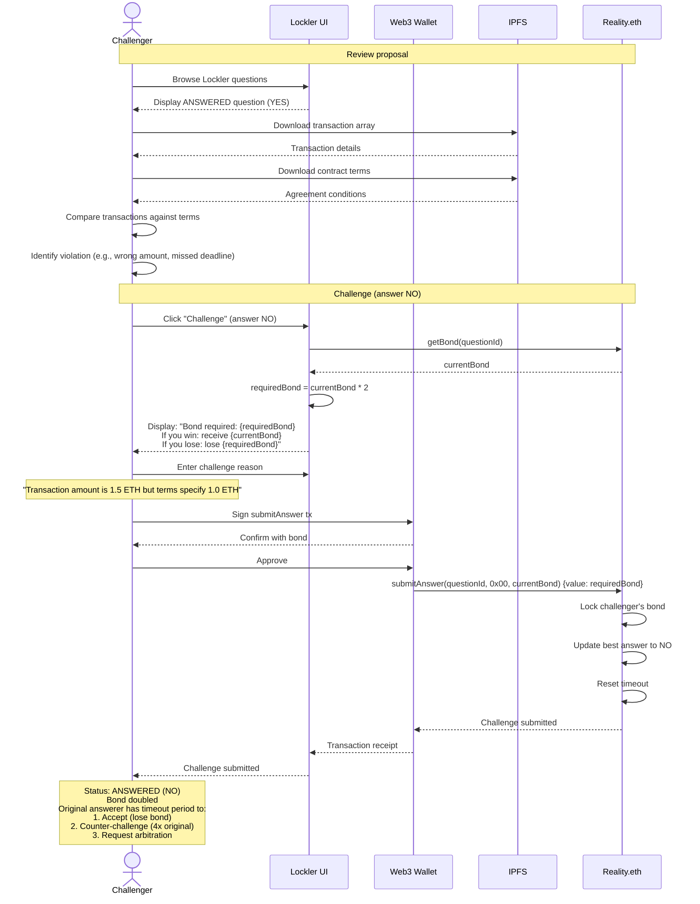
```mermaid
sequenceDiagram
    actor Challenger
    participant UI as Lockler UI
    participant Wallet as Web3 Wallet
    participant IPFS
    participant Oracle as Reality.eth

    Note over Challenger,Oracle: Review proposal
    Challenger->>UI: Browse Lockler questions
    UI-->>Challenger: Display ANSWERED question (YES)

    Challenger->>IPFS: Download transaction array
    IPFS-->>Challenger: Transaction details
    Challenger->>IPFS: Download contract terms
    IPFS-->>Challenger: Agreement conditions

    Challenger->>Challenger: Compare transactions against terms
    Challenger->>Challenger: Identify violation (e.g., wrong amount, missed deadline)

    Note over Challenger,Oracle: Challenge (answer NO)
    Challenger->>UI: Click "Challenge" (answer NO)

    UI->>Oracle: getBond(questionId)
    Oracle-->>UI: currentBond
    UI->>UI: requiredBond = currentBond * 2

    UI-->>Challenger: Display: "Bond required: {requiredBond}<br/>If you win: receive {currentBond}<br/>If you lose: lose {requiredBond}"

    Challenger->>UI: Enter challenge reason
    Note over Challenger: "Transaction amount is 1.5 ETH but terms specify 1.0 ETH"

    Challenger->>Wallet: Sign submitAnswer tx
    Wallet-->>Challenger: Confirm with bond
    Challenger->>Wallet: Approve

    Wallet->>Oracle: submitAnswer(questionId, 0x00, currentBond) {value: requiredBond}
    Oracle->>Oracle: Lock challenger's bond
    Oracle->>Oracle: Update best answer to NO
    Oracle->>Oracle: Reset timeout
    Oracle-->>Wallet: Challenge submitted
    Wallet-->>UI: Transaction receipt

    UI-->>Challenger: Challenge submitted
    Note over Challenger: Status: ANSWERED (NO)<br/>Bond doubled<br/>Original answerer has timeout period to:<br/>1. Accept (lose bond)<br/>2. Counter-challenge (4x original)<br/>3. Request arbitration
```

### 4.2 Detailed Contract Interactions

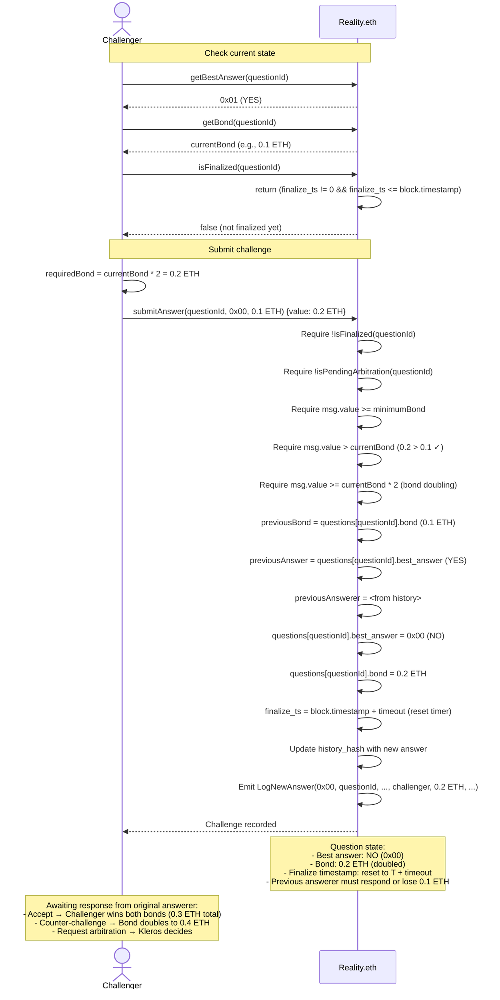
```mermaid
sequenceDiagram
    actor Challenger
    participant Oracle as Reality.eth

    Note over Challenger,Oracle: Check current state
    Challenger->>Oracle: getBestAnswer(questionId)
    Oracle-->>Challenger: 0x01 (YES)

    Challenger->>Oracle: getBond(questionId)
    Oracle-->>Challenger: currentBond (e.g., 0.1 ETH)

    Challenger->>Oracle: isFinalized(questionId)
    Oracle->>Oracle: return (finalize_ts != 0 && finalize_ts <= block.timestamp)
    Oracle-->>Challenger: false (not finalized yet)

    Note over Challenger,Oracle: Submit challenge
    Challenger->>Challenger: requiredBond = currentBond * 2 = 0.2 ETH

    Challenger->>Oracle: submitAnswer(questionId, 0x00, 0.1 ETH) {value: 0.2 ETH}

    Oracle->>Oracle: Require !isFinalized(questionId)
    Oracle->>Oracle: Require !isPendingArbitration(questionId)
    Oracle->>Oracle: Require msg.value >= minimumBond
    Oracle->>Oracle: Require msg.value > currentBond (0.2 > 0.1 ✓)
    Oracle->>Oracle: Require msg.value >= currentBond * 2 (bond doubling)

    Oracle->>Oracle: previousBond = questions[questionId].bond (0.1 ETH)
    Oracle->>Oracle: previousAnswer = questions[questionId].best_answer (YES)
    Oracle->>Oracle: previousAnswerer = <from history>

    Oracle->>Oracle: questions[questionId].best_answer = 0x00 (NO)
    Oracle->>Oracle: questions[questionId].bond = 0.2 ETH
    Oracle->>Oracle: finalize_ts = block.timestamp + timeout (reset timer)

    Oracle->>Oracle: Update history_hash with new answer
    Oracle->>Oracle: Emit LogNewAnswer(0x00, questionId, ..., challenger, 0.2 ETH, ...)
    Oracle-->>Challenger: Challenge recorded

    Note over Oracle: Question state:<br/>- Best answer: NO (0x00)<br/>- Bond: 0.2 ETH (doubled)<br/>- Finalize timestamp: reset to T + timeout<br/>- Previous answerer must respond or lose 0.1 ETH

    Note over Challenger: Awaiting response from original answerer:<br/>- Accept → Challenger wins both bonds (0.3 ETH total)<br/>- Counter-challenge → Bond doubles to 0.4 ETH<br/>- Request arbitration → Kleros decides
```

---

## 5. Request Arbitration

### 5.1 High-Level User Flow

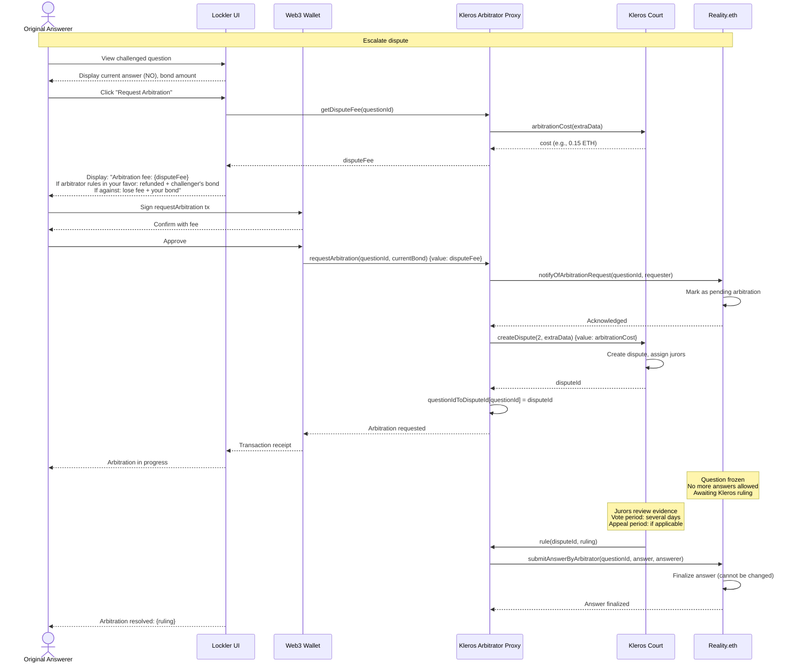
```mermaid
sequenceDiagram
    actor Requester as Original Answerer
    participant UI as Lockler UI
    participant Wallet as Web3 Wallet
    participant Arbitrator as Kleros Arbitrator Proxy
    participant Court as Kleros Court
    participant Oracle as Reality.eth

    Note over Requester,Oracle: Escalate dispute
    Requester->>UI: View challenged question
    UI-->>Requester: Display current answer (NO), bond amount

    Requester->>UI: Click "Request Arbitration"

    UI->>Arbitrator: getDisputeFee(questionId)
    Arbitrator->>Court: arbitrationCost(extraData)
    Court-->>Arbitrator: cost (e.g., 0.15 ETH)
    Arbitrator-->>UI: disputeFee

    UI-->>Requester: Display: "Arbitration fee: {disputeFee}<br/>If arbitrator rules in your favor: refunded + challenger's bond<br/>If against: lose fee + your bond"

    Requester->>Wallet: Sign requestArbitration tx
    Wallet-->>Requester: Confirm with fee
    Requester->>Wallet: Approve

    Wallet->>Arbitrator: requestArbitration(questionId, currentBond) {value: disputeFee}
    Arbitrator->>Oracle: notifyOfArbitrationRequest(questionId, requester)
    Oracle->>Oracle: Mark as pending arbitration
    Oracle-->>Arbitrator: Acknowledged

    Arbitrator->>Court: createDispute(2, extraData) {value: arbitrationCost}
    Court->>Court: Create dispute, assign jurors
    Court-->>Arbitrator: disputeId
    Arbitrator->>Arbitrator: questionIdToDisputeId[questionId] = disputeId
    Arbitrator-->>Wallet: Arbitration requested
    Wallet-->>UI: Transaction receipt

    UI-->>Requester: Arbitration in progress
    Note over Oracle: Question frozen<br/>No more answers allowed<br/>Awaiting Kleros ruling

    Note over Court: Jurors review evidence<br/>Vote period: several days<br/>Appeal period: if applicable

    Court->>Arbitrator: rule(disputeId, ruling)
    Arbitrator->>Oracle: submitAnswerByArbitrator(questionId, answer, answerer)
    Oracle->>Oracle: Finalize answer (cannot be changed)
    Oracle-->>Arbitrator: Answer finalized

    UI-->>Requester: Arbitration resolved: {ruling}
```

### 5.2 Detailed Contract Interactions

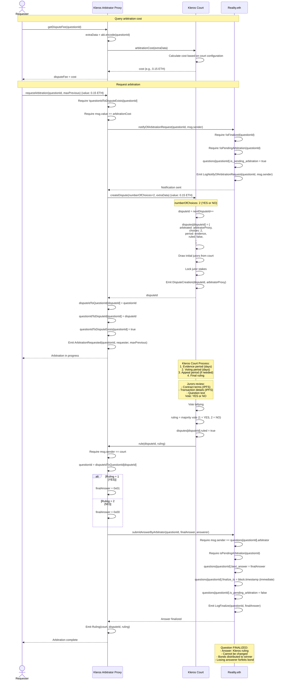
```mermaid
sequenceDiagram
    actor Requester
    participant Arbitrator as Kleros Arbitrator Proxy
    participant Court as Kleros Court
    participant Oracle as Reality.eth

    Note over Requester,Oracle: Query arbitration cost
    Requester->>Arbitrator: getDisputeFee(questionId)
    Arbitrator->>Arbitrator: extraData = abi.encode(questionId)
    Arbitrator->>Court: arbitrationCost(extraData)
    Court->>Court: Calculate cost based on court configuration
    Court-->>Arbitrator: cost (e.g., 0.15 ETH)
    Arbitrator-->>Requester: disputeFee = cost

    Note over Requester,Oracle: Request arbitration
    Requester->>Arbitrator: requestArbitration(questionId, maxPrevious) {value: 0.15 ETH}

    Arbitrator->>Arbitrator: Require !questionIdToDisputeExists[questionId]
    Arbitrator->>Arbitrator: Require msg.value >= arbitrationCost

    Arbitrator->>Oracle: notifyOfArbitrationRequest(questionId, msg.sender)
    Oracle->>Oracle: Require !isFinalized(questionId)
    Oracle->>Oracle: Require !isPendingArbitration(questionId)
    Oracle->>Oracle: questions[questionId].is_pending_arbitration = true
    Oracle->>Oracle: Emit LogNotifyOfArbitrationRequest(questionId, msg.sender)
    Oracle-->>Arbitrator: Notification sent

    Arbitrator->>Court: createDispute(numberOfChoices=2, extraData) {value: 0.15 ETH}
    Note over Court: numberOfChoices: 2 (YES or NO)

    Court->>Court: disputeId = nextDisputeId++
    Court->>Court: disputes[disputeId] = {<br/>  arbitrated: arbitratorProxy,<br/>  choices: 2,<br/>  period: evidence,<br/>  ruled: false,<br/>  ...<br/>}

    Court->>Court: Draw initial jurors from court
    Court->>Court: Lock juror stakes
    Court->>Court: Emit DisputeCreation(disputeId, arbitratorProxy)
    Court-->>Arbitrator: disputeId

    Arbitrator->>Arbitrator: disputeIdToQuestionId[disputeId] = questionId
    Arbitrator->>Arbitrator: questionIdToDisputeId[questionId] = disputeId
    Arbitrator->>Arbitrator: questionIdToDisputeExists[questionId] = true
    Arbitrator->>Arbitrator: Emit ArbitrationRequested(questionId, requester, maxPrevious)
    Arbitrator-->>Requester: Arbitration in progress

    Note over Court: Kleros Court Process:<br/>1. Evidence period (days)<br/>2. Voting period (days)<br/>3. Appeal period (if needed)<br/>4. Final ruling

    Note over Court: Jurors review:<br/>- Contract terms (IPFS)<br/>- Transaction details (IPFS)<br/>- Question text<br/>Vote: YES or NO

    Court->>Court: Vote tallying
    Court->>Court: ruling = majority vote (1 = YES, 2 = NO)
    Court->>Court: disputes[disputeId].ruled = true

    Court->>Arbitrator: rule(disputeId, ruling)
    Arbitrator->>Arbitrator: Require msg.sender == court
    Arbitrator->>Arbitrator: questionId = disputeIdToQuestionId[disputeId]

    alt Ruling = 1 (YES)
        Arbitrator->>Arbitrator: finalAnswer = 0x01
    else Ruling = 2 (NO)
        Arbitrator->>Arbitrator: finalAnswer = 0x00
    end

    Arbitrator->>Oracle: submitAnswerByArbitrator(questionId, finalAnswer, answerer)
    Oracle->>Oracle: Require msg.sender == questions[questionId].arbitrator
    Oracle->>Oracle: Require isPendingArbitration(questionId)

    Oracle->>Oracle: questions[questionId].best_answer = finalAnswer
    Oracle->>Oracle: questions[questionId].finalize_ts = block.timestamp (immediate)
    Oracle->>Oracle: questions[questionId].is_pending_arbitration = false
    Oracle->>Oracle: Emit LogFinalize(questionId, finalAnswer)
    Oracle-->>Arbitrator: Answer finalized

    Arbitrator->>Arbitrator: Emit Ruling(court, disputeId, ruling)
    Arbitrator-->>Requester: Arbitration complete

    Note over Oracle: Question FINALIZED:<br/>- Answer: Kleros ruling<br/>- Cannot be changed<br/>- Bonds distributed to winner<br/>- Losing answerer forfeits bond
```

---

## 6. Execute Transaction

### 6.1 High-Level User Flow

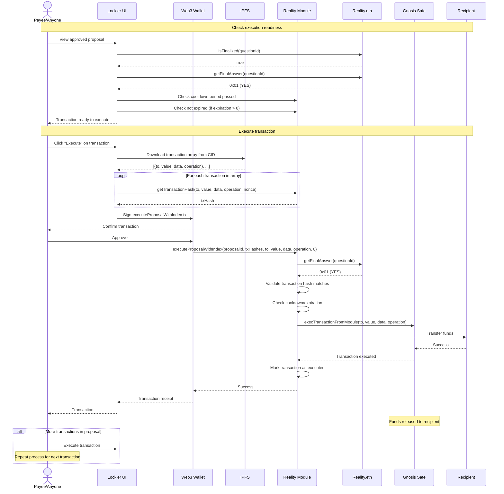
```mermaid
sequenceDiagram
    actor Executor as Payee/Anyone
    participant UI as Lockler UI
    participant Wallet as Web3 Wallet
    participant IPFS
    participant Module as Reality Module
    participant Oracle as Reality.eth
    participant Safe as Gnosis Safe
    participant Recipient

    Note over Executor,Recipient: Check execution readiness
    Executor->>UI: View approved proposal
    UI->>Oracle: isFinalized(questionId)
    Oracle-->>UI: true
    UI->>Oracle: getFinalAnswer(questionId)
    Oracle-->>UI: 0x01 (YES)

    UI->>Module: Check cooldown period passed
    UI->>Module: Check not expired (if expiration > 0)
    UI-->>Executor: Transaction ready to execute

    Note over Executor,Recipient: Execute transaction
    Executor->>UI: Click "Execute" on transaction #0

    UI->>IPFS: Download transaction array from CID
    IPFS-->>UI: [{to, value, data, operation}, ...]

    loop For each transaction in array
        UI->>Module: getTransactionHash(to, value, data, operation, nonce)
        Module-->>UI: txHash
    end

    UI->>Wallet: Sign executeProposalWithIndex tx
    Wallet-->>Executor: Confirm transaction
    Executor->>Wallet: Approve

    Wallet->>Module: executeProposalWithIndex(proposalId, txHashes, to, value, data, operation, 0)
    Module->>Oracle: getFinalAnswer(questionId)
    Oracle-->>Module: 0x01 (YES)
    Module->>Module: Validate transaction hash matches
    Module->>Module: Check cooldown/expiration
    Module->>Safe: execTransactionFromModule(to, value, data, operation)
    Safe->>Recipient: Transfer funds
    Recipient-->>Safe: Success
    Safe-->>Module: Transaction executed
    Module->>Module: Mark transaction as executed
    Module-->>Wallet: Success
    Wallet-->>UI: Transaction receipt

    UI-->>Executor: Transaction #0 executed successfully
    Note over Safe: Funds released to recipient

    alt More transactions in proposal
        Executor->>UI: Execute transaction #1 (sequential)
        Note over Executor: Repeat process for next transaction
    end
```

### 6.2 Detailed Contract Interactions

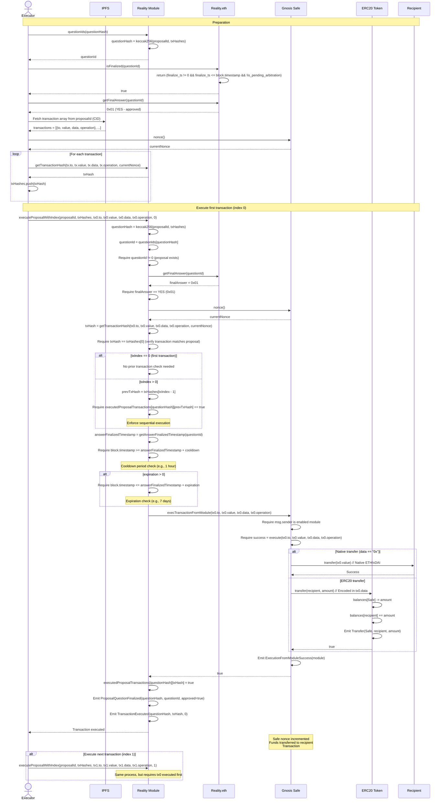
```mermaid
sequenceDiagram
    actor Executor
    participant IPFS
    participant Module as Reality Module
    participant Oracle as Reality.eth
    participant Safe as Gnosis Safe
    participant Token as ERC20 Token
    participant Recipient

    Note over Executor,Recipient: Preparation
    Executor->>Module: questionIds(questionHash)
    Module->>Module: questionHash = keccak256(proposalId, txHashes)
    Module-->>Executor: questionId

    Executor->>Oracle: isFinalized(questionId)
    Oracle->>Oracle: return (finalize_ts != 0 && finalize_ts <= block.timestamp && !is_pending_arbitration)
    Oracle-->>Executor: true

    Executor->>Oracle: getFinalAnswer(questionId)
    Oracle-->>Executor: 0x01 (YES - approved)

    Executor->>IPFS: Fetch transaction array from proposalId (CID)
    IPFS-->>Executor: transactions = [{to, value, data, operation}, ...]

    Executor->>Safe: nonce()
    Safe-->>Executor: currentNonce

    loop For each transaction
        Executor->>Module: getTransactionHash(tx.to, tx.value, tx.data, tx.operation, currentNonce)
        Module-->>Executor: txHash
        Executor->>Executor: txHashes.push(txHash)
    end

    Note over Executor,Recipient: Execute first transaction (index 0)
    Executor->>Module: executeProposalWithIndex(proposalId, txHashes, tx0.to, tx0.value, tx0.data, tx0.operation, 0)

    Module->>Module: questionHash = keccak256(proposalId, txHashes)
    Module->>Module: questionId = questionIds[questionHash]
    Module->>Module: Require questionId != 0 (proposal exists)

    Module->>Oracle: getFinalAnswer(questionId)
    Oracle-->>Module: finalAnswer = 0x01
    Module->>Module: Require finalAnswer == YES (0x01)

    Module->>Safe: nonce()
    Safe-->>Module: currentNonce

    Module->>Module: txHash = getTransactionHash(tx0.to, tx0.value, tx0.data, tx0.operation, currentNonce)
    Module->>Module: Require txHash == txHashes[0] (verify transaction matches proposal)

    alt txIndex == 0 (first transaction)
        Module->>Module: No prior transaction check needed
    else txIndex > 0
        Module->>Module: prevTxHash = txHashes[txIndex - 1]
        Module->>Module: Require executedProposalTransactions[questionHash][prevTxHash] == true
        Note over Module: Enforce sequential execution
    end

    Module->>Module: answerFinalizedTimestamp = getAnswerFinalizedTimestamp(questionId)
    Module->>Module: Require block.timestamp >= answerFinalizedTimestamp + cooldown
    Note over Module: Cooldown period check (e.g., 1 hour)

    alt expiration > 0
        Module->>Module: Require block.timestamp <= answerFinalizedTimestamp + expiration
        Note over Module: Expiration check (e.g., 7 days)
    end

    Module->>Safe: execTransactionFromModule(tx0.to, tx0.value, tx0.data, tx0.operation)
    Safe->>Safe: Require msg.sender is enabled module
    Safe->>Safe: Require success = execute(tx0.to, tx0.value, tx0.data, tx0.operation)

    alt Native transfer (data == "0x")
        Safe->>Recipient: transfer(tx0.value) // Native ETH/xDAI
        Recipient-->>Safe: Success
    else ERC20 transfer
        Safe->>Token: transfer(recipient, amount) // Encoded in tx0.data
        Token->>Token: balances[Safe] -= amount
        Token->>Token: balances[recipient] += amount
        Token->>Token: Emit Transfer(Safe, recipient, amount)
        Token-->>Safe: true
    end

    Safe->>Safe: Emit ExecutionFromModuleSuccess(module)
    Safe-->>Module: true

    Module->>Module: executedProposalTransactions[questionHash][txHash] = true
    Module->>Module: Emit ProposalQuestionFinalized(questionHash, questionId, approved=true)
    Module->>Module: Emit TransactionExecuted(questionHash, txHash, 0)
    Module-->>Executor: Transaction executed

    Note over Safe: Safe nonce incremented<br/>Funds transferred to recipient<br/>Transaction #0 marked as executed

    alt Execute next transaction (index 1)
        Executor->>Module: executeProposalWithIndex(proposalId, txHashes, tx1.to, tx1.value, tx1.data, tx1.operation, 1)
        Note over Module: Same process, but requires tx0 executed first
    end
```

---

## 7. Withdraw Unchallenged Answer

### 7.1 High-Level User Flow

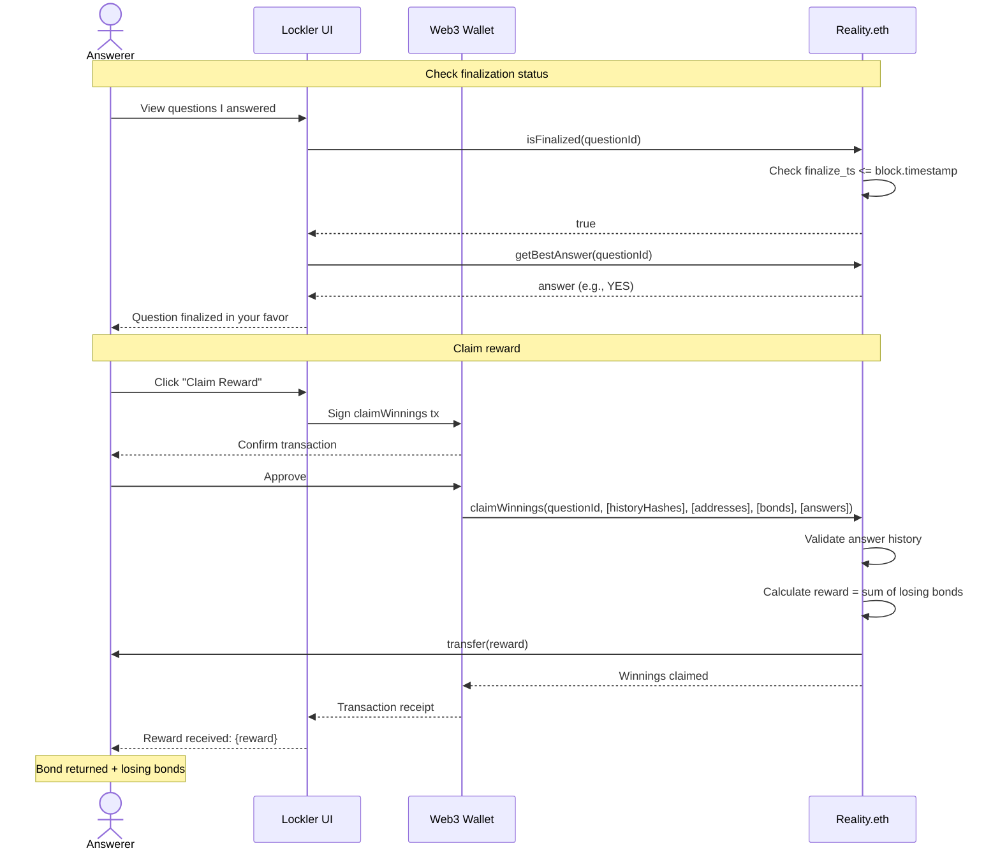
```mermaid
sequenceDiagram
    actor Answerer
    participant UI as Lockler UI
    participant Wallet as Web3 Wallet
    participant Oracle as Reality.eth

    Note over Answerer,Oracle: Check finalization status
    Answerer->>UI: View questions I answered
    UI->>Oracle: isFinalized(questionId)
    Oracle->>Oracle: Check finalize_ts <= block.timestamp
    Oracle-->>UI: true

    UI->>Oracle: getBestAnswer(questionId)
    Oracle-->>UI: answer (e.g., YES)

    UI-->>Answerer: Question finalized in your favor

    Note over Answerer,Oracle: Claim reward
    Answerer->>UI: Click "Claim Reward"

    UI->>Wallet: Sign claimWinnings tx
    Wallet-->>Answerer: Confirm transaction
    Answerer->>Wallet: Approve

    Wallet->>Oracle: claimWinnings(questionId, [historyHashes], [addresses], [bonds], [answers])
    Oracle->>Oracle: Validate answer history
    Oracle->>Oracle: Calculate reward = sum of losing bonds
    Oracle->>Answerer: transfer(reward)
    Oracle-->>Wallet: Winnings claimed
    Wallet-->>UI: Transaction receipt

    UI-->>Answerer: Reward received: {reward}
    Note over Answerer: Bond returned + losing bonds
```

### 7.2 Detailed Contract Interactions

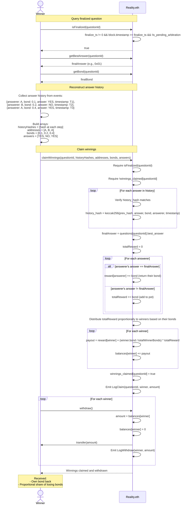
```mermaid
sequenceDiagram
    actor Winner
    participant Oracle as Reality.eth

    Note over Winner,Oracle: Query finalized question
    Winner->>Oracle: isFinalized(questionId)
    Oracle->>Oracle: finalize_ts != 0 && block.timestamp >= finalize_ts && !is_pending_arbitration
    Oracle-->>Winner: true

    Winner->>Oracle: getBestAnswer(questionId)
    Oracle-->>Winner: finalAnswer (e.g., 0x01)

    Winner->>Oracle: getBond(questionId)
    Oracle-->>Winner: finalBond

    Note over Winner,Oracle: Reconstruct answer history
    Winner->>Winner: Collect answer history from events:<br/>[<br/>  {answerer: A, bond: 0.1, answer: YES, timestamp: T1},<br/>  {answerer: B, bond: 0.2, answer: NO, timestamp: T2},<br/>  {answerer: A, bond: 0.4, answer: YES, timestamp: T3}<br/>]

    Winner->>Winner: Build arrays:<br/>historyHashes = [hash at each step]<br/>addresses = [A, B, A]<br/>bonds = [0.1, 0.2, 0.4]<br/>answers = [YES, NO, YES]

    Note over Winner,Oracle: Claim winnings
    Winner->>Oracle: claimWinnings(questionId, historyHashes, addresses, bonds, answers)

    Oracle->>Oracle: Require isFinalized(questionId)
    Oracle->>Oracle: Require !winnings_claimed[questionId]

    loop For each answer in history
        Oracle->>Oracle: Verify history_hash matches
        Oracle->>Oracle: history_hash = keccak256(prev_hash, answer, bond, answerer, timestamp)
    end

    Oracle->>Oracle: finalAnswer = questions[questionId].best_answer
    Oracle->>Oracle: totalReward = 0

    loop For each answerer
        alt answerer's answer == finalAnswer
            Oracle->>Oracle: reward[answerer] += bond (return their bond)
        else answerer's answer != finalAnswer
            Oracle->>Oracle: totalReward += bond (add to pot)
        end
    end

    Oracle->>Oracle: Distribute totalReward proportionally to winners based on their bonds

    loop For each winner
        Oracle->>Oracle: payout = reward[winner] + (winner.bond / totalWinnerBonds) * totalReward
        Oracle->>Oracle: balances[winner] += payout
    end

    Oracle->>Oracle: winnings_claimed[questionId] = true
    Oracle->>Oracle: Emit LogClaim(questionId, winner, amount)

    loop For each winner
        Winner->>Oracle: withdraw()
        Oracle->>Oracle: amount = balances[winner]
        Oracle->>Oracle: balances[winner] = 0
        Oracle->>Winner: transfer(amount)
        Oracle->>Oracle: Emit LogWithdraw(winner, amount)
    end

    Oracle-->>Winner: Winnings claimed and withdrawn

    Note over Winner: Received:<br/>- Own bond back<br/>- Proportional share of losing bonds
```

---

## 8. Claim Bond Rewards

### 8.1 Detailed Flow After Arbitration

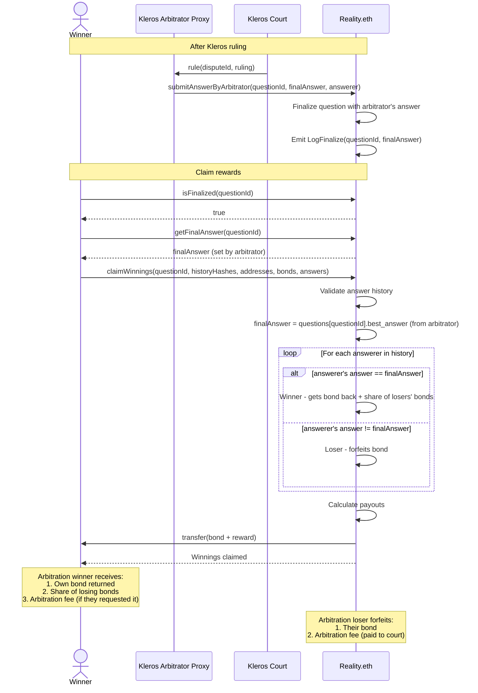
```mermaid
sequenceDiagram
    actor Winner
    participant Arbitrator as Kleros Arbitrator Proxy
    participant Court as Kleros Court
    participant Oracle as Reality.eth

    Note over Winner,Oracle: After Kleros ruling
    Court->>Arbitrator: rule(disputeId, ruling)
    Arbitrator->>Oracle: submitAnswerByArbitrator(questionId, finalAnswer, answerer)
    Oracle->>Oracle: Finalize question with arbitrator's answer
    Oracle->>Oracle: Emit LogFinalize(questionId, finalAnswer)

    Note over Winner,Oracle: Claim rewards
    Winner->>Oracle: isFinalized(questionId)
    Oracle-->>Winner: true

    Winner->>Oracle: getFinalAnswer(questionId)
    Oracle-->>Winner: finalAnswer (set by arbitrator)

    Winner->>Oracle: claimWinnings(questionId, historyHashes, addresses, bonds, answers)

    Oracle->>Oracle: Validate answer history
    Oracle->>Oracle: finalAnswer = questions[questionId].best_answer (from arbitrator)

    loop For each answerer in history
        alt answerer's answer == finalAnswer
            Oracle->>Oracle: Winner - gets bond back + share of losers' bonds
        else answerer's answer != finalAnswer
            Oracle->>Oracle: Loser - forfeits bond
        end
    end

    Oracle->>Oracle: Calculate payouts
    Oracle->>Winner: transfer(bond + reward)
    Oracle-->>Winner: Winnings claimed

    Note over Winner: Arbitration winner receives:<br/>1. Own bond returned<br/>2. Share of losing bonds<br/>3. Arbitration fee (if they requested it)

    Note over Oracle: Arbitration loser forfeits:<br/>1. Their bond<br/>2. Arbitration fee (paid to court)
```

---

## Summary of User Actions

### Action Overview Table

| Action | Actor | Contracts Involved | Result |
|--------|-------|-------------------|--------|
| **Create Lockler** | Payer | SafeFactory, Safe, DDH, ModuleFactory, Module, Oracle, Multisend | Safe deployed with module enabled |
| **Propose Transaction** | Payee | Module, Oracle, IPFS | Question created on Reality.eth |
| **Vouch For** | Community | Oracle | Submit YES answer with bond |
| **Challenge** | Community | Oracle | Submit NO answer with 2x bond |
| **Request Arbitration** | Either party | Arbitrator, Court, Oracle | Escalate to Kleros |
| **Execute Transaction** | Anyone | Module, Oracle, Safe, Token | Transfer funds to recipient |
| **Withdraw Answer** | Answerer | Oracle | Claim winnings after finalization |
| **Claim Arbitration Reward** | Winner | Oracle, Arbitrator | Claim bonds after ruling |

### State Transitions

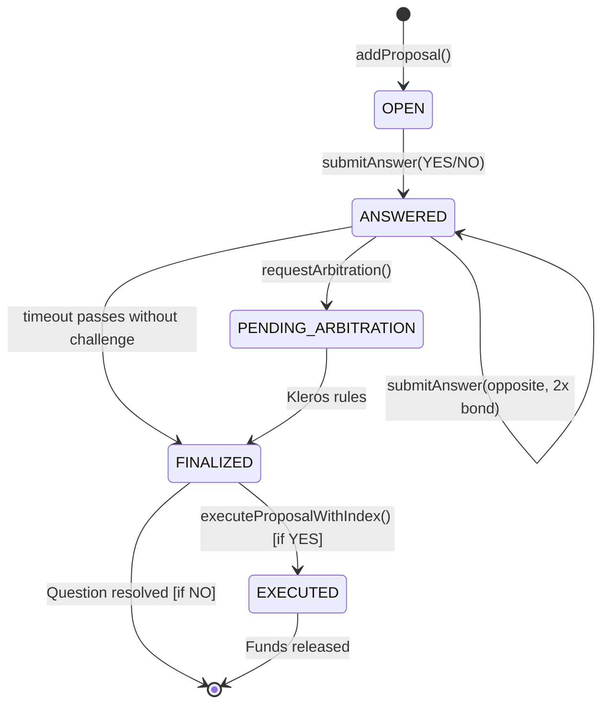
```mermaid
stateDiagram-v2
    [*] --> OPEN: addProposal()
    OPEN --> ANSWERED: submitAnswer(YES/NO)
    ANSWERED --> ANSWERED: submitAnswer(opposite, 2x bond)
    ANSWERED --> PENDING_ARBITRATION: requestArbitration()
    ANSWERED --> FINALIZED: timeout passes without challenge
    PENDING_ARBITRATION --> FINALIZED: Kleros rules
    FINALIZED --> EXECUTED: executeProposalWithIndex() [if YES]
    FINALIZED --> [*]: Question resolved [if NO]
    EXECUTED --> [*]: Funds released
```

### Bond Escalation Example

```
Question created with minimumBond = 0.1 ETH

Answer 1 (Alice): YES, bond = 0.1 ETH
Answer 2 (Bob): NO, bond = 0.2 ETH (2x)
Answer 3 (Alice): YES, bond = 0.4 ETH (2x)
Answer 4 (Bob): NO, bond = 0.8 ETH (2x)
[Bob requests arbitration, pays 0.15 ETH fee]

Kleros rules: YES
Winners: Alice
Alice receives: 0.5 ETH (her bonds) + 1.0 ETH (Bob's bonds) = 1.5 ETH
Bob loses: 1.0 ETH (bonds) + 0.15 ETH (arb fee) = 1.15 ETH
```

### Execution Requirements Checklist

Before `executeProposalWithIndex()` succeeds:

- ✅ Question exists (`questionIds[questionHash] != 0`)
- ✅ Question finalized (`isFinalized(questionId) == true`)
- ✅ Answer is YES (`getFinalAnswer(questionId) == 0x01`)
- ✅ Transaction hash matches proposal (`txHash == txHashes[index]`)
- ✅ Previous transactions executed (if `index > 0`)
- ✅ Cooldown period passed (`block.timestamp >= finalized + cooldown`)
- ✅ Not expired (if `expiration > 0`: `block.timestamp <= finalized + expiration`)
- ✅ Module enabled on Safe (`isModuleEnabled(module)`)
- ✅ Sufficient Safe balance for transaction

---

## Appendix A: Contract Responsibilities

### Gnosis Safe
**Purpose**: Secure fund custody with multisig requirements

**Responsibilities**:
- Hold escrowed funds (native tokens, ERC-20, ERC-721)
- Require 2-of-N signatures for standard transactions (user + module)
- Enable Reality Module to execute approved transactions
- Manage owners and threshold
- Provide transaction nonce for hash computation

**Key Functions Used**:
- `setup()` - Initialize with owners and threshold
- `enableModule()` - Grant execution permission to Reality Module
- `addOwnerWithThreshold()` - Add module as owner, set threshold to 2
- `execTransaction()` - Execute multisend for atomic module deployment
- `execTransactionFromModule()` - Called by module to release funds
- `nonce()` - Get current transaction nonce

### Reality Module (Zodiac)
**Purpose**: Proposal management and conditional execution

**Responsibilities**:
- Accept transaction proposals with IPFS CIDs
- Generate question text from proposal data
- Create questions on Reality.eth oracle
- Validate finalized answers before execution
- Enforce cooldown and expiration periods
- Execute transactions on Safe only when approved
- Track executed transactions to prevent replays

**Key Functions Used**:
- `setUp()` - Initialize with Safe, oracle, arbitrator, timeouts, bond
- `addProposal()` - Create proposal and Reality.eth question
- `buildQuestion()` - Generate question text from proposal
- `getTransactionHash()` - Compute EIP-712 transaction hash
- `executeProposalWithIndex()` - Execute approved transaction
- `executedProposalTransactions()` - Check if transaction already executed

**State Variables**:
- `questionIds[questionHash]` - Map proposal to Reality.eth question
- `executedProposalTransactions[questionHash][txHash]` - Track execution

### Reality.eth Oracle
**Purpose**: Social consensus via bonded answers

**Responsibilities**:
- Accept questions with minimum bond requirements
- Allow anyone to submit answers with increasing bonds
- Implement bond escalation (2x previous bond)
- Manage timeout periods for answer finalization
- Support arbitration requests
- Finalize answers after timeout without challenges
- Distribute bonds to winners

**Key Functions Used**:
- `askQuestionWithMinBond()` - Create question (called by module)
- `submitAnswer()` - Post an answer with bond
- `getFinalAnswer()` - Get finalized answer (called by module)
- `isFinalized()` - Check if question is settled
- `getMinBond()` - Get minimum required bond
- `getBond()` - Get current bond amount
- `getBestAnswer()` - Get current leading answer
- `isPendingArbitration()` - Check if escalated

**Answer Values**:
- `0x01` = YES (approve transaction)
- `0x00` = NO (reject transaction)

### Kleros Arbitrator Proxy
**Purpose**: Bridge to decentralized arbitration

**Responsibilities**:
- Calculate arbitration fees from Kleros Court
- Accept arbitration requests with fee payment
- Create disputes in Kleros Court
- Receive rulings from Kleros
- Submit final answers to Reality.eth
- Prevent further challenges after arbitration

**Key Functions Used**:
- `getDisputeFee()` - Query arbitration cost
- `requestArbitration()` - Escalate question to Kleros
- `rule()` - Receive ruling from Kleros (called by court)
- Internal: `submitAnswerByArbitrator()` - Finalize on Reality.eth

**Integration**:
- Maps Reality.eth questions to Kleros disputes
- Ensures arbitrator decision is final and binding
- Pays arbitration fees to Kleros Court

### DDH (Designated Dispute Helper)
**Purpose**: Atomic module deployment and template registration

**Responsibilities**:
- Deploy Reality Module proxy via Module Proxy Factory
- Register question template on Reality.eth
- Initialize module with correct parameters
- Ensure module starts as owner, then transfers to Safe
- Provide single-transaction deployment experience

**Key Function**:
- `deployWithEncodedParams()` - One-call deployment

**Why Needed**:
- Module must own itself to register template
- Must transfer ownership to Safe after setup
- Atomic operation prevents deployment failures

### Module Proxy Factory
**Purpose**: Deploy minimal proxies of Reality Module

**Responsibilities**:
- Create deterministic module addresses (CREATE2)
- Deploy minimal proxy pointing to master copy
- Call setUp() on deployed proxy
- Emit deployment events

**Key Function**:
- `deployModule()` - Deploy and initialize module

### Safe Proxy Factory
**Purpose**: Deploy minimal proxies of Gnosis Safe

**Responsibilities**:
- Create deterministic Safe addresses (CREATE2)
- Deploy minimal proxy pointing to singleton
- Call setup() on deployed proxy
- Emit deployment events

**Key Function**:
- `createProxyWithNonce()` - Deploy and initialize Safe

### Multisend
**Purpose**: Batch multiple transactions atomically

**Responsibilities**:
- Accept encoded transaction array
- Execute each transaction sequentially
- Revert all if any fails (atomic)
- Support both CALL and DELEGATECALL

**Key Function**:
- `multiSend()` - Execute transaction batch

**Used For**:
- Module deployment: enableModule() + addOwner() in one tx
- Ensures threshold increases atomically with module enablement

---

## Appendix B: Security Properties

### Trust Model
- **No admin keys** - No contract has privileged owner
- **Immutable configuration** - Module parameters set at deployment
- **Non-upgradeable** - All contracts are immutable
- **Censorship resistant** - Anyone can vouch/challenge/arbitrate

### Execution Guarantees
1. **Transaction approved** - Reality.eth question finalized with YES
2. **Cooldown passed** - Minimum wait after answer
3. **Not expired** - Within expiration window (if set)
4. **Correct hash** - Transaction matches proposal
5. **Sequential execution** - Previous transactions executed first
6. **Module enabled** - Safe has module enabled
7. **Sufficient funds** - Safe has balance for transaction

### Bond Economics
- **First answer**: `bond >= minimumBond`
- **Subsequent answers**: `bond >= previousBond * 2`
- **Winner reward**: Sum of all losing bonds
- **Arbitration**: Loser pays arbitration fee + loses bond

### Attack Prevention
- **Replay protection** - `executedProposalTransactions` mapping
- **Hash validation** - Transaction must match proposal
- **Sequential enforcement** - Cannot skip transactions
- **Nonce binding** - Hashes include Safe nonce
- **Cooldown** - Prevents instant execution after answer
- **Expiration** - Prevents stale proposal execution

---

This comprehensive set of sequence diagrams covers all major user actions in the Lockler system, showing both the user experience flow and the detailed smart contract interactions at each step.
